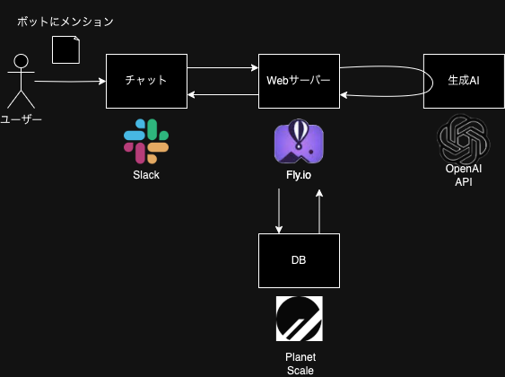

# ai-chat-bot

Slack上で動作するAIチャットボット

## システム



## 準備

### 環境変数を設定する

1. .envrc を作成する

```
export SLACK_SIGNING_SECRET=
export SLACK_BOT_TOKEN=
export OPENAI_API_KEY=
```

2. 有効化する

```
$ direnv allow
```

## 開発

### ローカルで実行する

1. Web サーバを起動する

```
$ npm run start
```

2. ローカル PC の Web サーバを外部公開する

```
$ ngrok http 3000
```

3. slack api の設定画面で Event Subscriptions のページを開く
4. Enable Events の Request URL に ngrok で作られた URL（Forwarding に記載の URL）を設定する
   例: https://\*\*\*\*.ngrok-free.app/slack/events

### 本番デプロイ

Actions で main コミット時に自動デプロイするので基本的に手動でデプロイすることはありません。

#### 事前設定

[Hands-on with Fly.io](https://fly.io/docs/hands-on/)

#### デプロイする

```
$ npm run deploy
```
